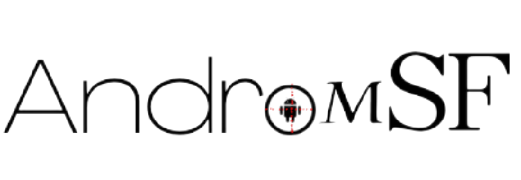
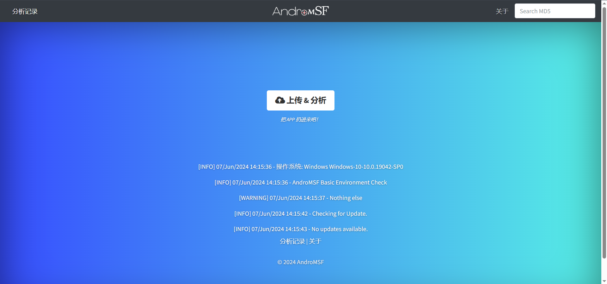
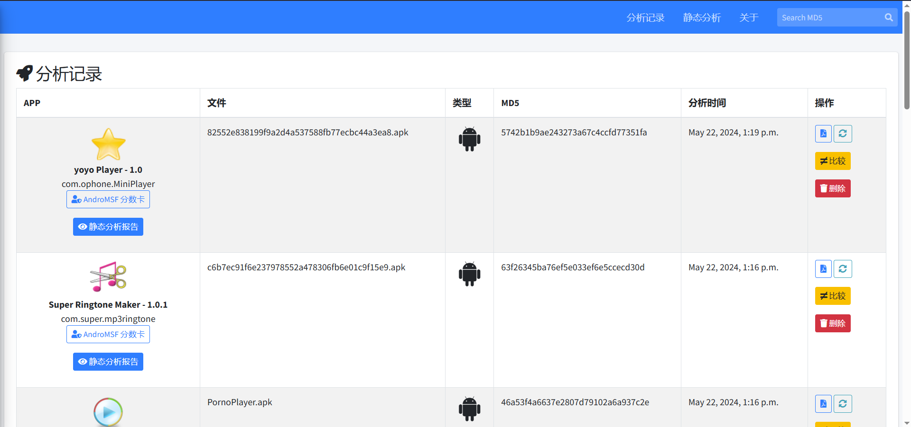
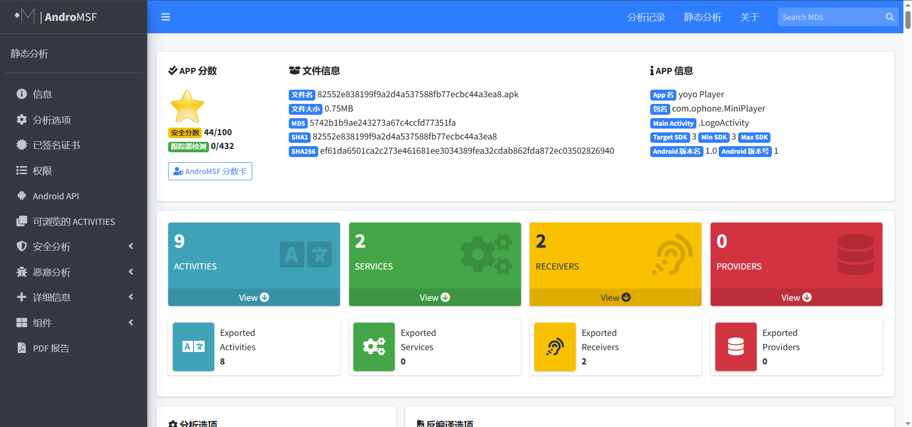
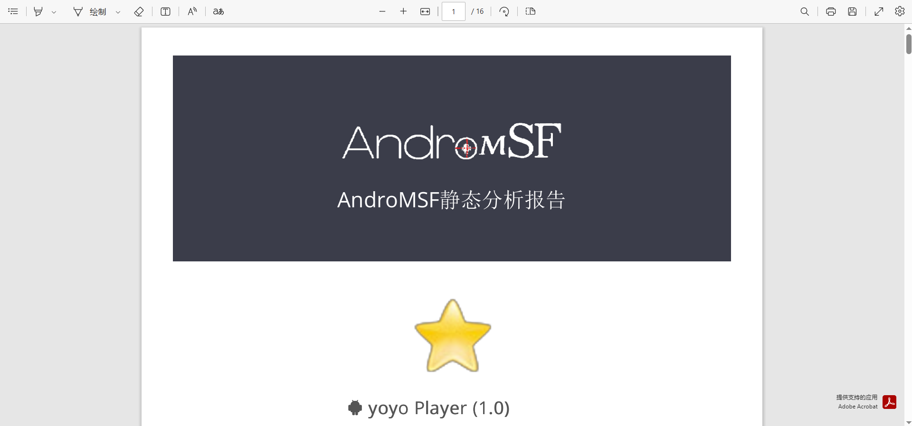

# AGMSF



👋`AndroMSF` 是 **南京审计大学** 2020 级计算机学院 **周梓豪** 做的毕业设计，是一个基于`Androguard` 的 `Android` 应用安全分析系统。`AndroMSF`  使用 `Django` 框架开发，使用 `SQLite` 进行存储。

Made  in China.

[](https://www.python.org/downloads/)
[](https://badge.fury.io/py/mobsf)
[](https://github.com/MobSF/Mobile-Security-Framework-MobSF/)
[](https://www.gnu.org/licenses/gpl-3.0.html)

## 📚安装环境依赖

- [Python 3.10+](https://www.python.org/)
- [Git](https://git-scm.com/download/win)
- [JDK 8+](https://www3.ntu.edu.sg/home/ehchua/programming/howto/JDK_Howto.html)
- [Microsoft Visual C++ Build Tools](https://visualstudio.microsoft.com/zh-hans/thank-you-downloading-visual-studio/?sku=BuildTools&rel=16)
- [OpenSSL](https://slproweb.com/products/Win32OpenSSL.html)
- [wkhtmltopdf](https://wkhtmltopdf.org/downloads.html)

## 👆安装完成后

```bash
git clone https://github.com/MrAshers/AGMSF.git
cd AGMSF
setup.bat
```
## 🌱运行！

```bash
run.bat 127.0.0.1:8000
```
在浏览器中打开 `http://localhost:8000/` 即可访问!

## 📝使用说明

- 选择自己想分析的 **Android APK** 文件拖入上传框或选择文件，上传成功即自动开始分析
- 分析完成后即可查看分析结果，可导出为 **PDF** 文件
- 结果对每个 APK 都有评分，评分越高越安全，评分依据 **CVSS评分系统** 判定

## Static Analysis
### 首页



### 分析记录


### 分析报告


### 导出 PDF 报告



### 分数卡
